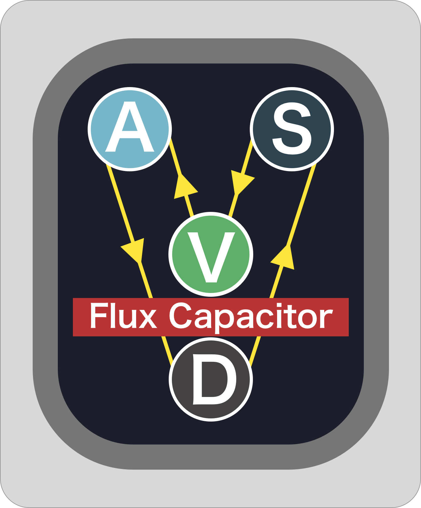

# FluxCapacitor

[](https://travis-ci.org/ca-atmosphere/FluxCapacitor)
[](http://cocoapods.org/pods/FluxCapacitor)
[](http://cocoapods.org/pods/FluxCapacitor)
[](http://cocoapods.org/pods/FluxCapacitor)



## Example

To run the example project, clone the repo, and run `pod install` from the Example directory first.

## Requirements

## Installation

FluxCapacitor is available through [CocoaPods](http://cocoapods.org). To install
it, simply add the following line to your Podfile:

```ruby
pod "FluxCapacitor"
```


## Author

ca-atmosphere, s1180183@gmail.com

## License

FluxCapacitor is available under the MIT license. See the LICENSE file for more info.
