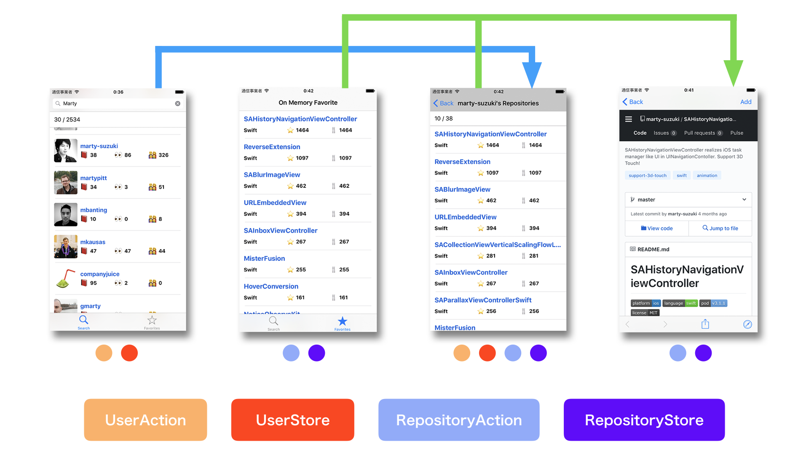

# FluxCapacitor

[](https://www.bitrise.io/app/da28e1f04e6fe024)
[](https://travis-ci.org/marty-suzuki/FluxCapacitor)
[](http://cocoapods.org/pods/FluxCapacitor)
[](http://cocoapods.org/pods/FluxCapacitor)
[](http://cocoapods.org/pods/FluxCapacitor)
[](https://github.com/Carthage/Carthage)

FluxCapacitor makes implementing [Flux](https://facebook.github.io/flux/) design pattern easily with protocols and typealias.

- Storable protocol
- Actionable protocol
- DispatchState protocol

## Requirements

- Xcode 9.2 or later
- Swift 4.0.3 or later
- iOS 9.0 or later

## Installation

### CocoaPods

FluxCapacitor is available through [CocoaPods](http://cocoapods.org). To install
it, simply add the following line to your Podfile:

```ruby
pod "FluxCapacitor"
```

### Carthage

If you’re using [Carthage](https://github.com/Carthage/Carthage), simply add FluxCapacitor to your `Cartfile`:

```ruby
github "marty-suzuki/FluxCapacitor"
```

## Usage

This is ViewController sample that uses Flux design pattern. If ViewController calls fetchRepositories method of RepositoryAction, it is reloaded automatically by observed changes of Constant in RepositoryStore after fetched repositories from Github. Introducing how to implement Flux design pattern with **FluxCapacitor**.

```swift
final class UserRepositoryViewController: UIViewController {
    @IBOutlet weak var tableView: UITableView!

    private let repositoryAction = RepositoryAction()
    private let repositoryStore = RepositoryStore.instantiate()
    private let userStore = UserStore.instantiate()
    private let dustBuster = DustBuster()
    private let dataSource = UserRepositoryViewDataSource()

    override func viewDidLoad() {
        super.viewDidLoad()

        dataSource.configure(with: tableView)
        observeStore()

        if let user = userStore.selectedUser.value {
            repositoryAction.fetchRepositories(withUserId: user.id, after: nil)
        }
    }

    private func observeStore() {
        repositoryStore.repositories
            .observe(on: .main, changes: { [weak self] _ in
                self?.tableView.reloadData()
            })
            .cleaned(by: dustBuster)
    }
}
```

### Dispatcher

First of all, implementing `DispatchState`. It connects Action and Store, but it plays a role that don't depend directly each other.

```swift
extension Dispatcher {
    enum Repository: DispatchState {
        typealias RelatedStoreType = RepositoryStore
        typealias RelatedActionType = RepositoryAction

        case isRepositoryFetching(Bool)
        case addRepositories([GithubApiSession.Repository])
        case removeAllRepositories
    }
}
```

### Store

Implementing `Store` with `Storable` protocol. `func reduce(with:_)` is called when Dispatcher dispatches DispatchStateType.　Please update store's value with Associated Values.

```swift
final class RepositoryStore: Storable {
    typealias DispatchStateType = Dispatcher.Repository

    let isRepositoryFetching: Constant<Bool>
    private let _isRepositoryFetching = Variable<Bool>(false)

    let repositories: Constant<[Repository]>
    private let _repositories = Variable<[Repository]>([])

    required init() {
        self.isRepositoryFetching = Constant(_isRepositoryFetching)
        self.repositories = Constant(_repositories)
    }

    func reduce(with state: Dispatcher.Repository) {
        switch state {
        case .isRepositoryFetching(let value):
            _isRepositoryFetching.value = value
        case .addRepositories(let value):
            _repositories.value.append(contentsOf: value)
        case .removeAllRepositories:
            _repositories.value.removeAll()
        }
    }
}
```

If you want to use any store, please use `XXXStore.instantiate()`. That static method returns its reference or new instance.
If you want to unregister any store from Dispatcher, please call `xxxStore.clear()`.

### Action

Implementing `Action` with `Actionable` protocol. If you call invoke method, it can dispatch value related DispatchStateType.

```swift
final class RepositoryAction: Actionable {
    typealias DispatchStateType = Dispatcher.Repository

    private let session: ApiSession

    init(session: ApiSession = .shared) {
        self.session = session
    }

    func fetchRepositories(withUserId id: String, after: String?) {
        invoke(.isRepositoryFetching(true))
        let request = UserNodeRequest(id: id, after: after)
        _ = session.send(request) { [weak self] in
            switch $0 {
            case .success(let value):
                self?.invoke(.addRepositories(value.nodes))
            case .failure:
                break
            }
            self?.invoke(.isRepositoryFetching(false))
        }
    }
}
```

### Observe changes with `Constant<Element>` / `Variable<Element>`

You can initialize a store with `instantiate()`. If reference of store is left, that method returns remained one. If reference is not left, that method returns new instance.
You can observe changes by Constant or Variable. When called observe, it returns `Dust`. So, clean up with `DustBuster`.

```swift
let dustBuster = DustBuster()

func observeStore() {
    // Get store instance
    let store = RepositoryStore.instantiate()

    // Observer changes of repositories that is `Constant<[Github.Repository]>`.
    store.repositories
        .observe(on: .main) { value in
            // do something
        }
        .cleaned(by: dustBuster)
}
```

> 
	Robert Zemeckis (1989) Back to the future Part II, Universal Pictures

#### `Constant<Element>` and `Variable<Element>`

`Variable<Element>` has getter and setter of Element.

```swift
let intVal = Variable<Int>(0)
intVal.value = 1
print(intVal.value) // 1
```

`Constant<Element>` has only getter of Element. So, you can initialize Constant with Variable.
Variable shares its value with Constant.

```swift
let variable = Variable<Int>(0)
let constant = Constant(variable)
variable.value = 1
print(variable.value) // 1
print(constant.value) // 1
```

In addition, Constant that initialize with some Variable, it can use same observation.

```swift
let variable = Variable<Int>(0)
let constant = Constant(variable)

_ = variable.observe { value in
    print(value) // 0 -> 10
}

_ = constant.observe { value in
    print(value) // 0 -> 10
}

variable.value = 10
```

### with RxSwift

You can use FluxCapacitor with RxSwift like [this link](./Examples/Flux%2BMVVM/FluxCapacitorSample/Sources/Common/Flux/User/UserStore.swift).

Or implement `func asObservable()` like this.

```swift
// Constant
extension PrimitiveValue where Trait == ImmutableTrait {
    func asObservable() -> Observable<Element> {
        return Observable.create { [weak self] observer in
            let dust = self?.observe { observer.onNext($0) }
            return Disposables.create { dust?.clean() }
        }
    }
}
```

## Example

To run the example project, clone the repo, and run `pod install` and `carthage update` from the Example directory first. In addition, you must set Github Personal access token.

```swift
// ApiSessionType.swift
extension ApiSession: ApiSessionType {
    static let shared: ApiSession = {
        let token = "" // Your Personal Access Token
        return ApiSession(injectToken: { InjectableToken(token: token) })
    }()
}
```

Application structure is like below.



- [SearchViewController](./Examples/Flux/FluxCapacitorSample/Sources/UI/Search) (with RxSwift) You can search Github user.
- [FavoriteViewController](./Examples/Flux/FluxCapacitorSample/Sources/UI/Favorite) You can stock favorites on memory.
- [UserRepositoryViewController](./Examples/Flux/FluxCapacitorSample/Sources/UI/UserRepository) You can display a user's repositories.
- [RepositoryViewController](./Examples/Flux/FluxCapacitorSample/Sources/UI/Repository) You can display webpage of repository, and add favorites on memory.

[GithubKitForSample](https://github.com/marty-suzuki/GithubKitForSample) is used in this sample project.

### Additional

Flux + MVVM Sample is [here](./Examples/Flux+MVVM).

## Migration Guide

[FluxCapacitor 0.10.0 Migration Guide](./Documentations/MigrationGuide_0_10_0.md)

## Author

marty-suzuki, s1180183@gmail.com

## License

FluxCapacitor is available under the MIT license. See the LICENSE file for more info.
